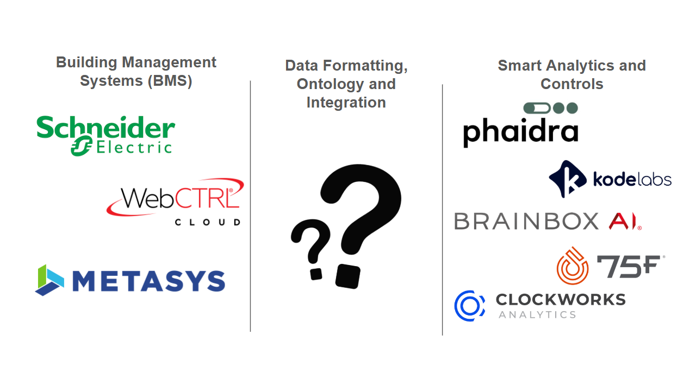

# Why So Few Buildings Are Actually Ready for Smart Building Intelligence

Despite widespread adoption of building management systems and IoT devices, very few data centers and enterprise facilities are genuinely prepared to integrate advanced analytics or AI-driven control. A Forrester Consulting study commissioned by Johnson Controls found that **only 7% of data center leaders say their building systems and equipment are fully integrated**, highlighting how fragmented most “smart” facilities still are (Johnson Controls Data Center Spotlight / Forrester Consulting). This lack of integration has measurable consequences: organizations report decreased operating efficiencies (65%), reduced customer loyalty (64%), and increased regulatory penalties (60%) due to incomplete or unreliable operational data (Johnson Controls / Forrester Consulting).

A major contributor to this gap is a misunderstanding of what data readiness actually means. Many facilities generate large volumes of telemetry but remain stuck at what Phaidra describes as **Class 2 data**. These are datasets that are clean (missing values have been [imputed](https://www.google.com/search?q=imputed+definition&oq=imputed+definition&gs_lcrp=EgZjaHJvbWUqDwgAEAAYRhj5ARixAxiABDIPCAAQABhGGPkBGLEDGIAEMgcIARAAGIAEMgcIAhAAGIAEMgcIAxAAGIAEMggIBBAAGBYYHjIICAUQABgWGB4yCAgGEAAYFhgeMggIBxAAGBYYHjIICAgQABgWGB4yCAgJEAAYFhge0gEIMTk0NmowajeoAgCwAgA&sourceid=chrome&ie=UTF-8)), reflecting tightly constrained operating ranges rather than true system dynamics (Phaidra, *Artificial Intelligence Readiness*). Systems that have only ever operated at conservative loads cannot provide the behavioral diversity needed for predictive or autonomous control. As Phaidra notes, **data alone does not create intelligence**; without context, semantics, and exposure to real operating extremes, AI systems lack any reliable definition of correct behavior (Phaidra, *Class 3 and 4 Data Make Predictive AI Possible*).

# Where Data Goes Wrong: From BMS and IoT to Analytics Platforms

Many of the most damaging data quality issues originate at the point of collection. Sensors drift over time, lose calibration, or fail silently, while communication faults introduce gaps or corrupted time series that are rarely addressed systematically (Phaidra, *Artificial Intelligence Readiness*). These issues are particularly insidious because they often appear plausible, allowing bad data to flow uninterrupted into analytics platforms. Over time, this silent degradation undermines long-term control strategies and erodes trust in analytical outputs.

Even when telemetry is numerically intact, it is frequently **semantically broken**. Building data is often labeled inconsistently or not labeled at all, with equipment names reflecting local conventions rather than shared meaning. Phaidra highlights examples where identical assets appear under entirely different naming schemes, forcing downstream systems to guess intent and relationships (Phaidra, *Artificial Intelligence Readiness*). This lack of semantic structure leads anomaly detection systems to flag normal behavior, causes AI analysis to misinterpret system state, and allows faulty assumptions to be embedded directly into trained models (Phaidra, *The Hidden Cost of Dirty Data*).

Another critical failure point is the absence of intentional system exploration. Most operational datasets exclude edge cases such as high-load events, extreme weather response, or failure recovery. Without controlled experimentation or simulation, models cannot generalize beyond the narrow conditions they have seen before (Phaidra, *Class 3 and 4 Data Make Predictive AI Possible*). This results in AI systems that perform well in idealized conditions but fail when real-world variability inevitably appears (citation not found).

# How the Industry Is Bridging the Gap Today

To compensate for poor data readiness, most organizations rely on **manual engineering workflows or organization-specific automation scripts** to prepare building data for intelligent applications. This process typically involves selecting relevant entities, classifying equipment, inferring implied relationships, and correcting labels by hand—often using spreadsheets as the primary interface (Mapped, *Data Enrichment*). While this approach can work for small deployments, it does not scale, creates brittle pipelines, and embeds assumptions that are difficult to audit or transfer across teams.

[**Project Haystack**](https://www.project-haystack.org/) and [**Brick Schema**](https://brickschema.org/) are two of the most important open-source efforts aimed at fixing one of the root causes of bad building data: inconsistent naming and lack of semantic meaning. Project Haystack focuses on a lightweight tagging approach, allowing building data points (like sensors, meters, and setpoints) to be labeled with standardized key-value tags that describe what the point is and how it’s used, making data more human- and machine-readable across systems.

Brick Schema, by contrast, provides a more formal ontology, modeling buildings as graphs of equipment, points, and spaces with explicitly defined relationships between them. Together, they represent complementary approaches to the same problem: Haystack optimizing for practicality and adoption in live BMS environments, and Brick optimizing for rigor and interoperability in analytics, digital twins, and AI pipelines.

Some companies are beginning to formalize this middle layer by building dedicated data infrastructure focused on semantic enrichment and normalization. Phaidra describes workflows centered on **semantic mapping, knowledge graphs, and physics-informed simulators**, where raw telemetry is transformed into structured, context-rich data that AI agents can safely reason over (Phaidra, *Artificial Intelligence Readiness*). This approach allows synthetic data generation, safe-to-fail simulations, and model pre-training without exposing live systems to unnecessary risk (Phaidra, *Class 3 and 4 Data Make Predictive AI Possible*).

Parallel efforts from companies such as [**Mapped**](http://mapped.com/) and [**ACE IoT**](https://aceiotsolutions.com/) focus on creating systems that ingest data from existing BMS and IoT sources, normalize and tag it consistently, and expose clean abstractions to downstream applications. Rather than forcing every analytics or control vendor to solve the data problem independently, these platforms aim to decouple intelligent applications from the messy realities of building telemetry. Together, these approaches reflect a growing recognition across the industry: the limiting factor for smart buildings is no longer algorithms or compute, but the slow, fragile process of turning bad building data into something intelligence can trust.

# Sources

**Johnson Controls & Forrester Consulting,** *Data Center Spotlight: Building the Foundation for Smart, Resilient, and Sustainable Data Centers,* [https://www.johnsoncontrols.com/insights/data-center-spotlight](https://www.johnsoncontrols.com/insights/data-center-spotlight)  
**Mapped,** *Data Enrichment: Turning Building Data into Outcomes, [https://go.mapped.com/-data-enrichment-webinar-on-demand](https://go.mapped.com/-data-enrichment-webinar-on-demand)*  
**Phaidra,** *Artificial Intelligence Readiness: The Hidden Cost of Dirty Data,* [https://www.phaidra.ai/blog/artificial-intelligence-readiness](https://www.phaidra.ai/blog/artificial-intelligence-readiness)  
**Phaidra,** *Class 3 and Class 4 Data Make Predictive AI Possible,* [https://www.phaidra.ai/blog/class-3-and-4-data-make-predictive-AI-possible](https://www.phaidra.ai/blog/class-3-and-4-data-make-predictive-AI-possible)