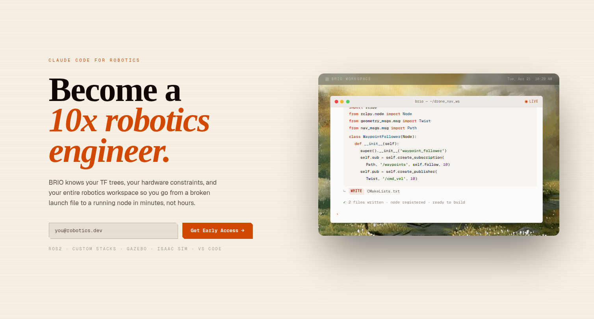

## Introduction

Brio is a cloud-hosted AI co-pilot for ROS 2 robots. It pairs a Jetson-side ROS 2 node that snapshots robot state with a FastAPI service that runs a supervisor agent, which dispatches tool calls back to the operator's machine over SSE. The whole thing lives in a single uv workspace — `brio-monolith` — that bundles the cloud API, local CLI, ROS 2 node, and shared libraries into one repo. This post walks through how that repository is organized and why each piece exists.

We created a demo for what we've done for Brio that you can find here:



## The high-level architecture

There are two runtime components that talk to each other over the network:

1. **`brio-fastapi`** is the cloud service. It accepts the robot state, hands it to a Pydantic-AI supervisor agent (with explorer and coder sub-agents under it), streams the agent's reply back, and exposes an MCP/SSE bridge so the agent's tool calls can reach the operator.
2. **`brio`** (the local CLI) sits on the operator's laptop. It opens a streaming connection to the FastAPI service, receives MCP tool calls — `bash`, `read_file`, `write_file` — and executes them locally against the operator's environment.

Auth, per-user API keys, and usage accounting live in Supabase, with migrations checked into `supabase/migrations/`.

## The workspace layout

The repo is a uv workspace, declared in the root `pyproject.toml`. Workspace members are split between `apps/` (deployable things) and `libs/` (shared code):

| Path                       | What it is                                                                  |
| -------------------------- | --------------------------------------------------------------------------- |
| `apps/brio-fastapi`        | Cloud API. `/v1/debug` runs the agent, `/v1/cli/*` is the MCP SSE bridge, `/v1/admin/users*` handles user management, `/mcp` exposes FastMCP. |
| `apps/brio`                | Local CLI. POSTs queries, streams MCP tool calls back, executes them.       |
| `libs/aiagent`             | The Pydantic-AI agents themselves — supervisor, explorer, coder, plus persistence and prompts. |
| `libs/brio-shared`         | Shared pydantic models (`RobotState` and friends) and the `MCPClient` protocol. |
| `libs/ingest`              | Placeholder for future ingestion work.                                      |
| `supabase/migrations`      | Users table, `api_keys`, Stripe columns, auth trigger.                      |
| `scripts/`                 | Manual MCP and endpoint smoke tests.                                        |

Everything is built and managed by `uv sync` from the root.

## Why a monolith?

The "monolith" framing is deliberate. The two runtime components are tightly coupled by a shared data contract — `RobotState`, MCP message shapes, the API key format — and a single repo lets all four workspace members evolve that contract together. A change to the `RobotState` schema lands in `libs/brio-shared` and immediately breaks both the FastAPI route and the ROS 2 publisher at type-check time, instead of drifting silently across two separate repos.

It also keeps the test surface honest: pytest is configured at the root with `asyncio_mode = "auto"` and explicitly excludes the `knowledge/` submodules from collection, so a single `uv run pytest` exercises the whole system.

## The knowledge submodules

There's various submodules that include extensive examples and documentation to enable Brio to be better at robotics-specific applications in comparison to tools like Claude Code or Cursor. We have various documentation and add as much relevant informaiton into a vector database. When we get asked quesitons, we then load that information and ensure that the agent has all the relevant possible information to make informed robotics design decisions.

## Takeaways

The Brio monolith is a clean example of a small-team AI product that spans cloud, edge, and CLI without fragmenting into a dozen repos. A uv workspace handles the Python side, colcon handles the ROS 2 side, a single shared library pins the data contract between them, and Supabase carries the auth and billing state. If you're building something similar — an agent that has to reach into a user's local environment to actually *do* anything — the layout here is a reasonable starting template.
