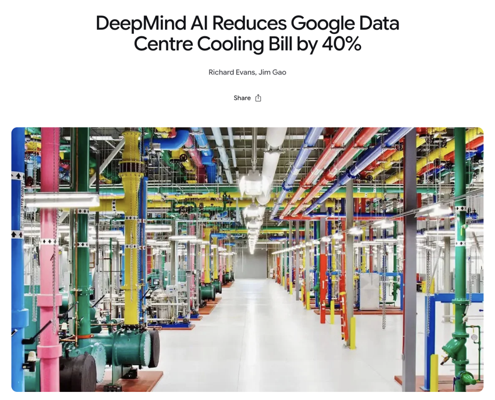
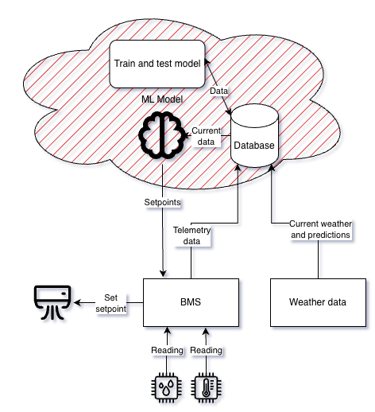
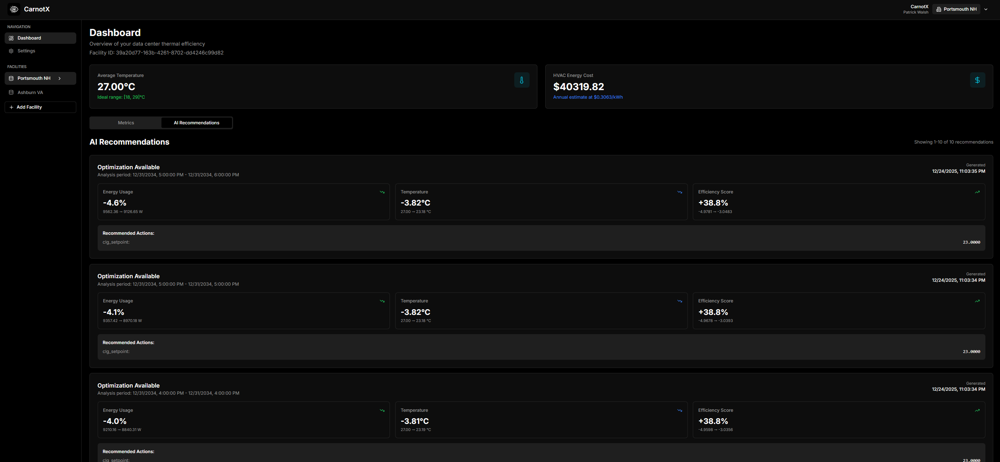

## Introduction

Smart buildings, which are facilities that use internet of things and software communication protocols to connect sensors and actuators to a Building Management System (BMS), have been only increasing in popularity. According to Juniper Research, [the number of smart buildings globally is expected to rise from 26 million in 2025 to 165 million in 2030](https://www.juniperresearch.com/press/industrial-smart-buildings-energy-wastage-bespoke-vertical-solutions/). With this technology, there comes multiple BMS options that allow facility operators to get a better understanding of what contributes the most to their electric bill. Studies consistently show that [buildings account for roughly 40% of global energy consumption](https://www.weforum.org/stories/2021/02/why-the-buildings-of-the-future-are-key-to-an-efficient-energy-ecosystem/), with HVAC representing the largest controllable share. As a result, even incremental performance improvements translate into significant economic and environmental impact.

## Control Strategies

Some BMS options have begun to implement custom control strategies into their software. Advanced control strategies such as fault detection, energy management information systems (EMIS), and most notably model predictive control (MPC) routinely demonstrate double‑digit energy savings in controlled studies. Field deployments, however, show a wide distribution of results, with average savings often clustering around 10–30% depending on system scope and maturity. The best outcomes typically occur where controls influence not just setpoints but system coordination, storage, and load shifting. Performance is therefore less about the algorithm itself and more about how deeply it is embedded into operational decision‑making.

Both in traditional commercial facilities and in large enterprise facilities like data centers, MPC has been used to successfully save large amounts of energy, even in the most performant facilities. One of the most notable implementations of machine learning-powered MPC is the [2016 Google Deepmind paper](https://deepmind.google/blog/deepmind-ai-reduces-google-data-centre-cooling-bill-by-40/), which added a reinforcement learning algorithm in place of the traditional control systems in the facility, netting 40% energy savings on the fully trained model.

Even in traditional commercial facilities, there are still significant energy savings to be had. In 2024, Schneider Electric published a white paper on Myrspoven’s machine learning algorithms used to control [HVAC setpoints in 600 K-12 schools in Sweden](https://myrspoven.com/wp-content/uploads/2024/09/White-Paper-%E2%80%93-Using-AI-to-Optimize-HVAC.pdf). Across the board, Myrspoven saw a net 4% average heating energy savings and an amazing 15% electric energy savings. 

## How does it work?

At the fundamental level, these machine learning systems are updating setpoints for different individual components within a facility. A setpoint is the desired temperature you program your thermostat to maintain in the example of an HVAC system, or the motor speed of a fan. Model predictive control reduces energy use even when acting only on setpoints because it anticipates future load and constraint changes, allowing the system to operate closer to efficiency-optimal regions and avoid aggressive, wasteful actuator behavior.

When implementing these machine learning systems, some information about the sensor input from the BMS must be provided. First, there must be some buckets of sensors created to describe the type of information provided. Specifically, if these sensor readings are observable (things that happen when setpoints are set) or actionable (setpoints that are set by the machine learning system). Some systems, like CarnotX’s implementation, require some additional granularity, like variables located inside the facility (like indoor temperature) and outside the facility (like outdoor temperature). This allows for CarnotX to properly set up a simulation that understands what variables will and won’t change depending on the setpoint set by the machine learning system.

Systems like CarnotX or Myrspoven operate in the cloud as an extension of the BMS. They create what is called middleware, which is a program that sends sensor readings from the BMS to the cloud, where an agent can train and test a model. The data goes through a Extraction, Transformation, and Load (ETL) pipeline to ensure the data is properly formatted for machine learning purposes. Once the model is trained, it’s tested to ensure that setpoints are within the allowed range and that the setpoint updates do actually save energy for the facility. Once these have been confirmed, the model is deployed on the facility.

Some systems like CarnotX support AI recommendations prior to full control. Some operators may prefer to have a model first provide recommendations before the full control sequence, and CarnotX allows for just that. Every 15 minutes, CarnotX publishes its recommended setpoints, as well as the potential energy and temperature savings.

## The path to success for implementing machine learning systems

The level of success in these implementations is strongly correlated with modeling choices and operational alignment. System modeling is where a simulation of a facility is made in tandem with a real facility. This is often used for model testing and model accuracy prior to making changes in the real-world facility. There are three types of models: white-box, gray-box, and black-box. White-box models take the most effort on the side of the facility operators and developers as the physics is modeled within the facility. Airflow, exact electricity usage, and thorough environment testing is required to ensure that white box models are accurate.

Gray-box models use some physical simulation techniques like described above, and use some data so that less developer time is required. One of the most popular gray-box simulation techniques is Resistance Capacitance (RC) simulation, which uses heat transfer and other physical simulation techniques along with existing data to create a model of a facility.

Black box simulation purely uses data manipulation techniques to create a model of the facility. While this approach requires the most up-front data, it also requires the least amount of effort on the side of the developer and facility team while still creating an accurate and consistent model.

Gray‑box and data‑driven models dominate practical deployments because they balance accuracy with deployability. Fully physics‑based models are costly to maintain, while purely black‑box approaches can sometimes struggle with extrapolation and system changes. Successful projects treat models as living artifacts that evolve with building operation rather than one‑time deliverables. This mindset reduces fragility and improves trust from operators.

Despite decades of progress, several lessons continue to challenge the industry. Data quality, system heterogeneity, and lack of standards for tagging, performance evaluation, and savings verification remain persistent obstacles. Many reported savings are difficult to compare due to inconsistent baselines and short evaluation periods. Occupant behavior, operator overrides, and equipment degradation further complicate outcomes. These issues are not failures of smart building concepts but reflections of the complexity of real buildings.

Another enduring tension lies between automation and human control. Operators often hesitate to relinquish authority to algorithms they cannot easily interpret, particularly when comfort complaints carry immediate consequences. Transparency, explainability, and graceful fallback modes are therefore as important as raw performance. Smart buildings succeed when technology augments operator expertise rather than attempting to replace it. Adoption accelerates when tools fit existing workflows instead of demanding wholesale operational change.

## Results

These techniques have been studied for some time now, for example with Google Deepmind’s data center cooling white paper coming out back in 2016\. Research articles in model predictive control are increasing in popularity due to the fact that the technology is now stable enough to show consistent performance improvements across multiple facilities. A review article that came out in September 2025 describes the most prevalent research papers in the MPC industry. [They saw an average energy savings of 25-30%, with the top 25% of papers saving facilities 34-86% on energy.](https://www.sciencedirect.com/science/article/abs/pii/S0306261925008219)

Smart buildings are no longer a speculative vision but an evolving practice shaped by real‑world constraints. Their performance potential is well‑documented, yet consistently realizing that potential requires disciplined attention to data, integration, and organizational readiness. Advanced controls like MPC work best when paired with pragmatic modeling, clear objectives, and operator trust. The industry’s remaining challenges are less about inventing new algorithms and more about standardization, scalability, and long‑term operability. As these barriers fall, smart buildings will increasingly become the default rather than the exception.