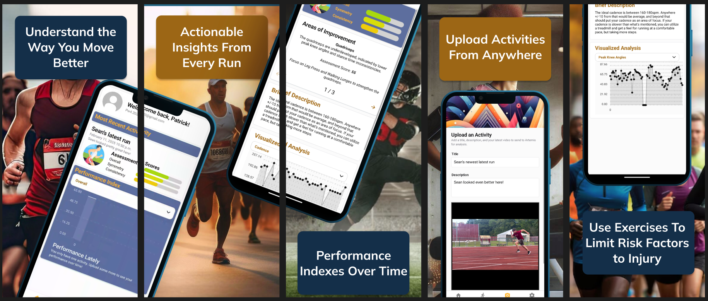
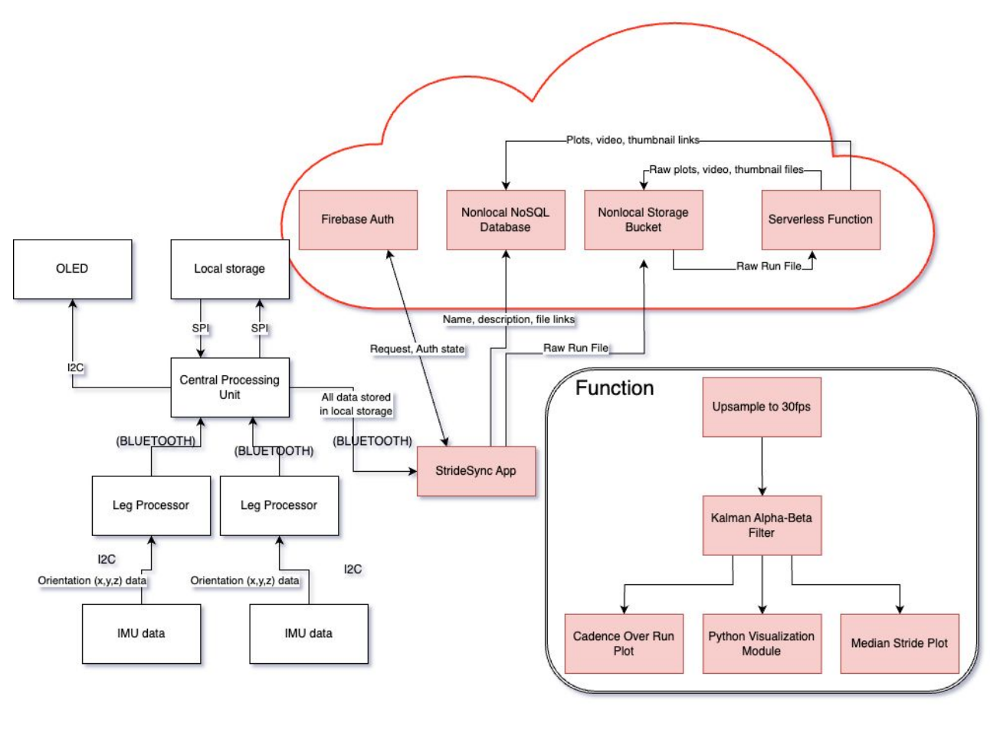

+++
date = "2026-01-11T00:01:00Z"
draft = false
title = 'Artemis System Design'
+++

## What is Artemis?

Artemis (formerly known as StrideSync) was originally my senior capstone project and was a project I continued for 9 months after I graduated in 2020.

Artemis helps competitive athletes learn more about their gait mechanics, either through dedicated hardware knee sleeves and a wrist watch, or a cloud-based computer vision system.

The original website after we graduated can be found [here](https://pw42020.wixsite.com/artemislab). I was the lead architect and engineer on this project, while also executing our user interviews and Product Market Fit tests.

To work with multiple individuals, Artemis integrated `YOLO-based` computer vision. We used this in the cloud with a `Firebase` backend, attached to a `React Native` frontend.



## My Involvement in Artemis

I was the software architect for the computer vision application, embedded system design, and the frontend application. We used Arduino to interface with the hardware directly and write our software on bare-metal ESP32s.

Our software diagram, pictured above, shows the implementation with all of the communication protocols used to communicate on the hardware. We used a -SD card to save runs throughout the activity, and bluetooth to communicate between our wrist watch, which was our command and control center, to our knee sleeves, which collected gait data using inertial measurement unit sensors (IMUs).

One difficulty we ran into was that much of the data from the IMUs was that they would significantly vary from what their expected value. This was largely because analog sensors like IMUs, especially when experiencing high movement load like being strapped to a leg, can have a high variance from their actual value. We were able to get around this constraint by using alpha-beta Kalman filters.

Our software processing structure treated the leg movement as individual signals, and used signal processing techniques to retrieve cadence, lateral sway, and other relevant metrics from user movement. A display of one of our earlier demos of software in use can be seen below:



## How Gait is Calculated
Artemis calculates gait by measuring joint angles and motion metrics through a combination of wearable hardware and cloud-based software processing:
- **Dual IMU Sensor System:** The system utilizes two Inertial Measurement Units (IMUs) mounted on a knee sleeve—one positioned above the knee and one below it.
- **Orientation Comparison**: By comparing the relative orientation of these two IMUs in real-time, the system calculates the angles of different anatomical planes. This allows the tool to track knee flexion and motion throughout the entire gait cycle.
- **Metric Derivation**: These angular measurements are used to identify specific gait characteristics, including:
    - **Pronation/Supination**: Determined by measuring the inward and outward rotation of the leg (specifically looking for rotations of at least 15°).
    - **Overstriding**: Identified when specific leg extension angles reach approximately 25°.
    - **Knee Angles**: Monitored to ensure they stay within an accuracy range of ±15° compared to laboratory standards.
- **Cloud-Based Filtering**: To ensure accuracy during the dynamic, high-stress movements of a run, raw data is processed using a Kalman filter on a cloud backend. This minimizes errors from undersampling and provides a more accurate estimation of actual knee angles.
- **Data Visualization**: After a run, the collected data is uploaded to a computer or laptop. A graphical user interface (GUI) then generates a visual representation of the runner's stride, displaying median stride, cadence, and a scrollable video-like model of leg movement.

Below is our original final slide deck for our presentation:

<iframe src="/files/fpr.pdf" style="width: 100%; height: 400px"></iframe>

