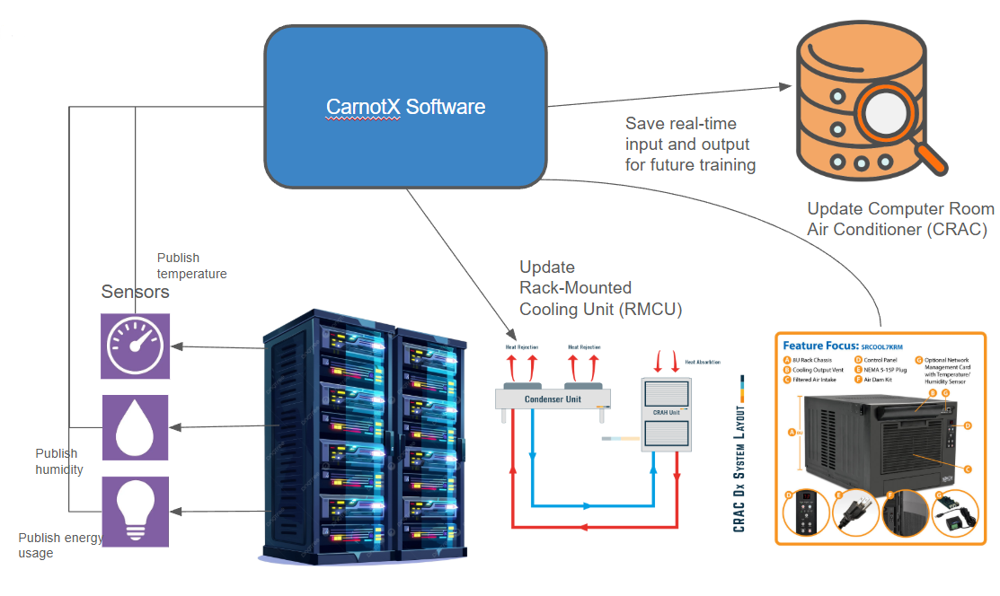

+++
date = '2025-01-11T19:38:54-05:00'
draft = false
title = 'CarnotX Control System Design'
+++

## What is CarnotX Control?

CarnotX Control is a supervisory control platform designed to improve building system performance without replacing existing Building Management Systems (BMSs).
Rather than operating individual field controllers directly, CarnotX sits above the BMS layer and computes system-level control decisions based on a unified view of building equipment and operating conditions.

To build this system, we built a self-training reinforcement learning algorithm that dynamically updates its training data nightly. We first require some amount of training information to initialize a [`black-box`](#what-are-the-types-of-simulators) simulator.

## What are the types of simulators?

Simulation plays a central role in developing and validating control strategies for building systems. Different modeling approaches trade off physical accuracy, data requirements, and computational complexity. In practice, facilities are often modeled using a combination of white-box, gray-box, and black-box simulators, depending on available information and the intended use of the model.

White-box models are physics-based and derived from first principles, using thermodynamic and fluid-flow equations to represent equipment and building dynamics. These models typically require detailed knowledge of system topology, material properties, and equipment parameters, and are commonly implemented using building energy modeling tools or custom physical simulations. White-box models provide strong interpretability and extrapolate well outside observed operating conditions, making them useful for design studies and evaluating control strategies under hypothetical scenarios. However, they are time-consuming to build, require extensive calibration, and are often too computationally expensive for real-time control applications.

A way many people in the industry make white-box simulators is through using [EnergyPlus](https://energyplus.net/), which was used to create our initial dataset.

Gray-box models combine simplified physical structure with parameters learned from operational data. For example, a thermal zone may be represented using a small network of resistances and capacitances, while coefficients are identified using system identification techniques. This approach preserves some physical interpretability while significantly reducing modeling effort and improving computational efficiency. Gray-box models are commonly used in model predictive control (MPC) for buildings, where accurate short-term dynamics matter more than detailed physical realism. They strike a balance between robustness and practicality, especially when full system specifications are unavailable.

Black-box models rely entirely on data to learn the relationship between inputs and outputs, without explicitly encoding physical structure. These models may use regression, neural networks, or other machine learning techniques to predict temperatures, loads, or energy consumption based on control actions and disturbances. Black-box approaches are fast to deploy when sufficient historical data exists and can capture complex nonlinear behaviors that are difficult to model analytically. However, they can be sensitive to data quality, may not generalize well outside the training distribution, and provide limited physical interpretability, which can complicate validation and safety analysis in control applications.

In operational control systems, these modeling approaches are often complementary rather than mutually exclusive. White-box or gray-box models may be used to define feasible operating regions and physical constraints, while black-box models refine predictions of system response under typical operating conditions. This layered approach enables safer deployment of advanced control strategies while leveraging the strengths of both physics-based and data-driven methods when modeling complex building facilities.

## How did we make our simulator?

We make our simulator by separating variables we get from a BMS into two buckets -- either weather variables or otherwise. Variables like outside temperature, humidity, and solar diffusion are related to the sun and the current weather. Therefore, these can either be modeled independently or estimated using weather predictions from weather packages in python.

Other variables use the input of those metrics as well as any other "input" variables like computer workload to create a working black-box model of a facility.

From there, we integrated our models with reinforcement learning algorithms to give our reinforcement learning system a place to train other than on the actual facility. Training MPC on an actual facility like a smart building or a data center is dangerous and could lead to extreme strain on physical components or extremely high energy bills -- both of which should be avoided.

We built all of our simulation and control capabilities inside of an Extract, Transform, Load (ETL) pipeline. These pipelines automate workflows by agglomerating data from various sources, transforming it into useful data, and loading into a destination that can be easily used for business purposes. For us, those purposes are primarily creating forecasts and control algorithms.

## CarnotX Control Demo

Here's a video of a demo of what we currently have for our control section. We're adding another section to make an easy bridge to the messy Building Management System data called CarnotX Conduit. More on this soon!

